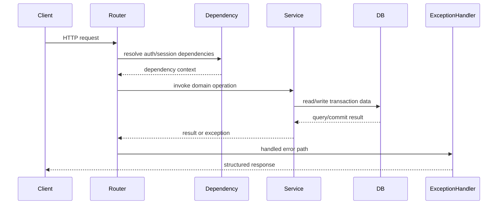
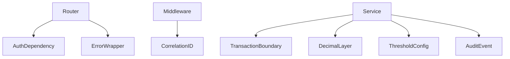

# Backend Topology

## Request Lifecycle

```mermaid
sequenceDiagram
    participant Client
    participant Router
    participant Dependency
    participant Service
    participant DB
    participant ExceptionHandler

    Client->>Router: HTTP request
    Router->>Dependency: resolve auth/session dependencies
    Dependency-->>Router: dependency context
    Router->>Service: invoke domain operation
    Service->>DB: read/write transaction data
    DB-->>Service: query/commit result
    Service-->>Router: result or exception
    Router->>ExceptionHandler: handled error path
    ExceptionHandler-->>Client: structured response
```

## Governance Overlay

```mermaid
graph TD
    Router --> AuthDependency
    Router --> ErrorWrapper
    Middleware --> CorrelationID
    Service --> TransactionBoundary
    Service --> DecimalLayer
    Service --> ThresholdConfig
    Service --> AuditEvent
```
